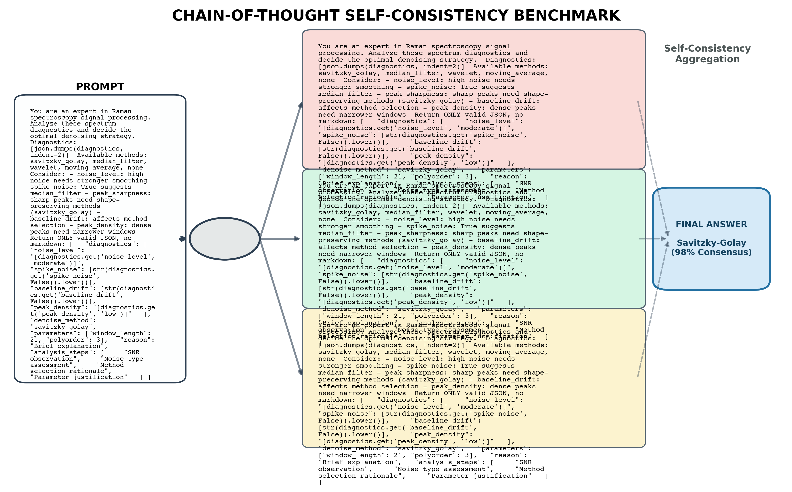
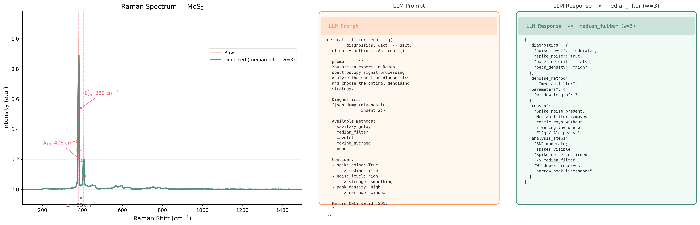
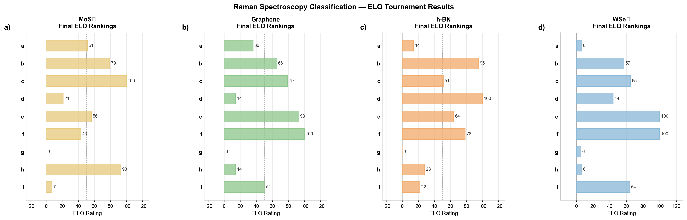
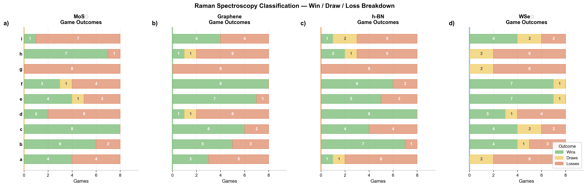
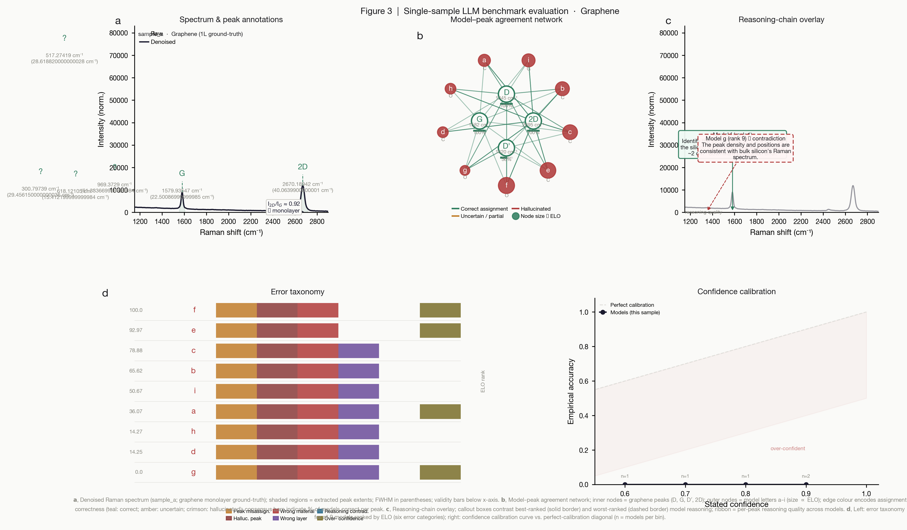

# Raman Arena

Benchmarking LLMs on Raman spectrum interpretation. Each model runs the same pipeline
(denoise → peak extraction → material / layer-number classification) on unlabeled spectra,
and the outputs are then ranked head-to-head by an LLM judge using an ELO tournament.

## Pipeline

```bash
python complete_pipeline_claude.py  unmarked/sample_a.json  out_dir/     # Claude  (claude-sonnet-4-6)
python complete_pipeline_openai.py  unmarked/sample_a.json  out_dir/     # OpenAI
python comeplete_pipeline_gemini.py unmarked/sample_a.json  out_dir/     # Gemini  (GEMINI_MODEL env var)
```

Each run writes `processed_spectrum.json`, `classification_result.json`,
`chain_of_thought.json`, and `spectrum_plot.png`. API keys come from `.env`.



Denoising and peak extraction, illustrated on the MoS₂ sample:



## Samples and ground truth

| Sample | Material | Ground truth | Ranking folder | ELO results |
|---|---|---|---|---|
| `sample_a` | Graphene | `mono_g_cu_001` — monolayer on Cu | `ranking_sample_a/` | `graphene_elo_results_grok/` |
| `sample_b` | h-BN | `hbn_bulk_001` — bulk | `ranking_sample_b/` | `hbn_elo_results_grok/`, `hbn_elo_results_claude_sonnet_4.6/` |
| `sample_c` | MoS₂ | `mos2_mono_sio2_001` — monolayer on SiO₂/Si | `ranking_sample_c/` | `mos2_elo_results_grok/`, `mos2_elo_results_biased/` |
| `sample_d` | WSe₂ | `wse2_mono_sio2_001` — monolayer on SiO₂/Si | `ranking_sample_d/` | `wse2_elo_results_grok/`, `wse2_elo_results_claude/` |
| `sample_e` | TMC | — | not yet ranked | — |

## Model key

Ranking folders are blinded as `a`–`i`. The mapping is:

| Letter | Model | Letter | Model | Letter | Model |
|---|---|---|---|---|---|
| a | Claude Haiku 4.5 | d | Gemini 2.5 Pro | g | GPT-4o |
| b | Claude Opus 4.6 | e | Gemini 3 Pro Preview | h | GPT-5.1 |
| c | Claude Sonnet 4.6 | f | Gemini 3.1 Pro Preview | i | GPT-5.2 |

## ELO tournament

Round robin, 36 games per material (all 9 models paired once), ELO on a 0–100 scale,
start 50, K = 16. Judges: `grok-4.20-0309-reasoning` and `claude-sonnet-4-6`
(extended thinking), each given the hard-coded ground truth for the sample.

```bash
python graphene_grok.py      # or hBN_grok.py / mos2_grok.py / wse2_grok.py   (Grok judge)
python ranking_sample_a.py   # a=graphene  b=h-BN  c=MoS2  d=WSe2             (Claude judge)
```

Final ELO by material (Grok judge):



Win / draw / loss breakdown:



| Model | Graphene | h-BN | MoS₂ | WSe₂ |
|---|---|---|---|---|
| e — Gemini 3 Pro | **100.0** | 71.6 | 36.0 | **100.0** |
| f — Gemini 3.1 Pro | 99.6 | 71.2 | 65.2 | 99.5 |
| c — Sonnet 4.6 | 79.1 | 51.2 | **100.0** | 51.1 |
| b — Opus 4.6 | 57.6 | 95.2 | 86.8 | 43.9 |
| i — GPT-5.2 | 57.6 | 21.7 | 7.5 | 43.5 |
| a — Haiku 4.5 | 36.1 | 14.4 | 51.7 | 35.3 |
| d — Gemini 2.5 Pro | 14.4 | **100.0** | 49.0 | 57.9 |
| h — GPT-5.1 | 14.4 | 21.2 | 64.6 | 13.1 |
| g — GPT-4o | 0.0 | 0.0 | 0.0 | 5.2 |

Per-material match logs and judge rationales are in each `*_elo_results_*/FINAL_RANKING.md`.

## Material identification accuracy

Correct material call (independent of the ELO judge), per sample:

| Model | Graphene | h-BN | MoS₂ | WSe₂ |
|---|---|---|---|---|
| Gemini 3 Pro Preview | ✅ | ✅ | ✅ | ✅ |
| Gemini 3.1 Pro Preview | ✅ | ✅ | ✅ | ✅ |
| Claude Opus 4.6 | ❌ | ✅ | ✅ | ❌ |
| Gemini 2.5 Pro | ❌ | ✅ | ✅ | ❌ |
| Claude Sonnet 4.6 | ✅ | ❌ | ✅ | ❌ |
| Claude Haiku 4.5 | ❌ | ❌ | ✅ | ❌ |
| GPT-5.1 | ❌ | ❌ | ✅ | ❌ |
| GPT-5.2 | ❌ | ❌ | ❌ | ❌ |
| GPT-4o | ❌ | ❌ | ❌ | ❌ |

Layer number is the harder half: even the models that name WSe₂ correctly call the
monolayer "few-layer", and most models mistake the substrate Si peak for the material.

Multi-panel breakdown for graphene (spectrum, predictions vs. ELO, best/worst chain of
thought, cross-model comparison):



## Layout

```
unmarked/              input spectra (sample_a … sample_e)
data/                  raw .dat sources
denoised_spectra/      extracted peaks per sample
preprocessing/         standardize_input.py, peak_extraction.py
claude_models/         per-model pipeline outputs (haiku_4.5, opus_4.6, sonnet_4.6)
gemini_models/         (gemini_2.5_pro, gemini_3_pro_preview, gemini_3.1_pro_preview)
openai_models/         (gpt_4o, gpt_5.1, gpt_5.2)
ranking_sample_[a-d]/  blinded a–i copies fed to the judges
*_elo_results_*/       per-game JSON, FINAL_RANKING.md, ELO_RANKING_CHART.png
figures/               publication figures (+ generating scripts in repo root)
```

Figure scripts: `figure_bar_chart.py` (ELO bars + W/D/L), `figures/bar_chart.py`
(alternate ELO chart → `elo_ranking_v2.png`), `graphene_analysis.py` (multi-panel),
`spectra_plot.py` (spectrum + denoising), `prompt_figure.py` (prompt report).

## To do

- [x] Run the pipeline for all unmarked samples across 9 models
- [x] Compare outputs via ELO ranking (two independent judges)
- [x] Generate figures
- [ ] Prompt variants for face / layer-number prediction, and compare prompt → output deltas
- [ ] Rank `sample_e` (TMC)
